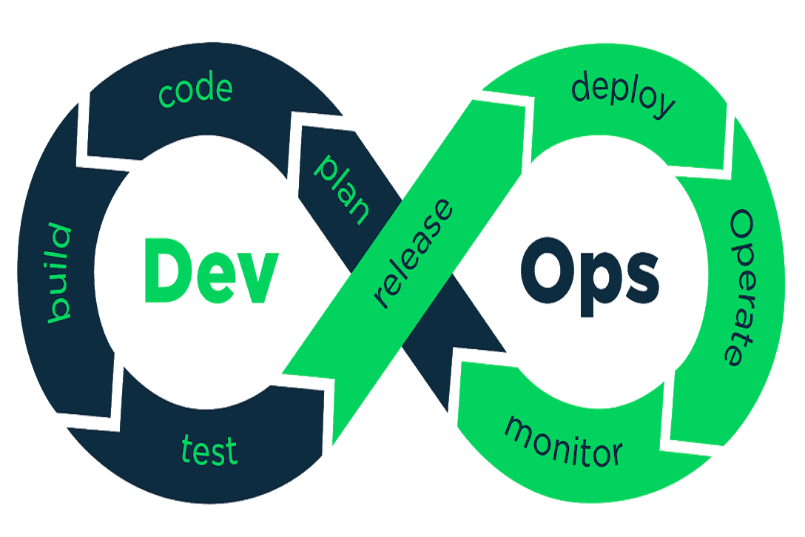
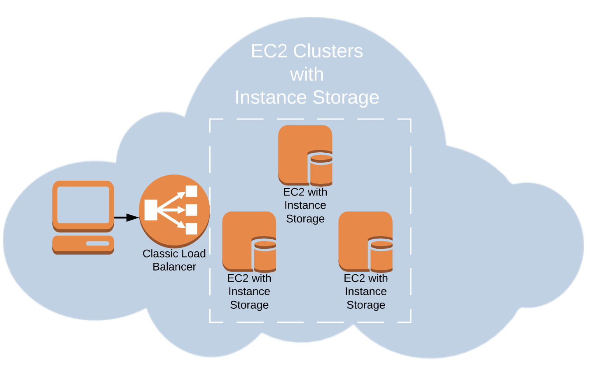
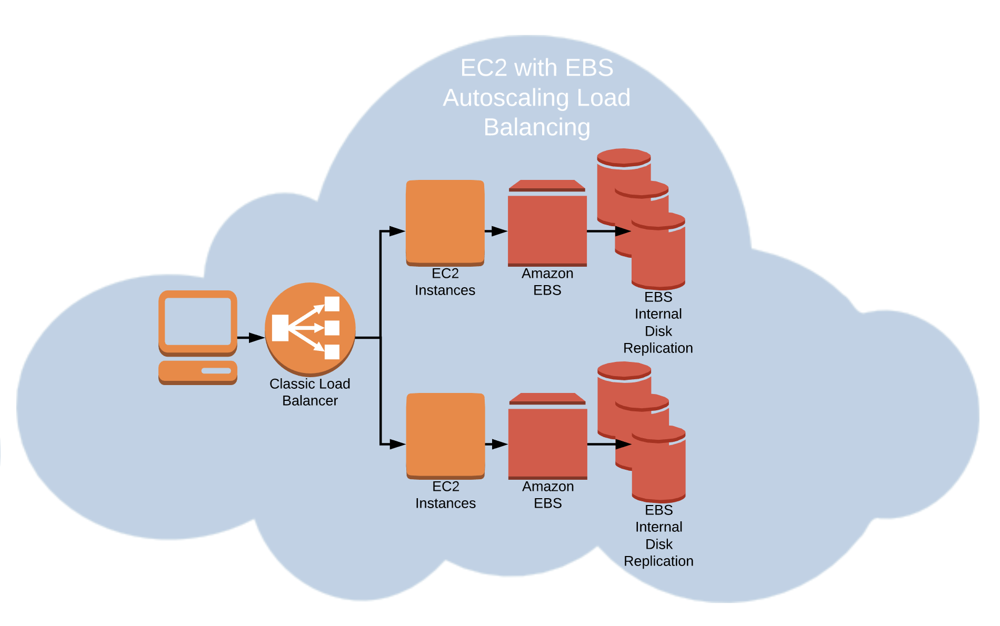
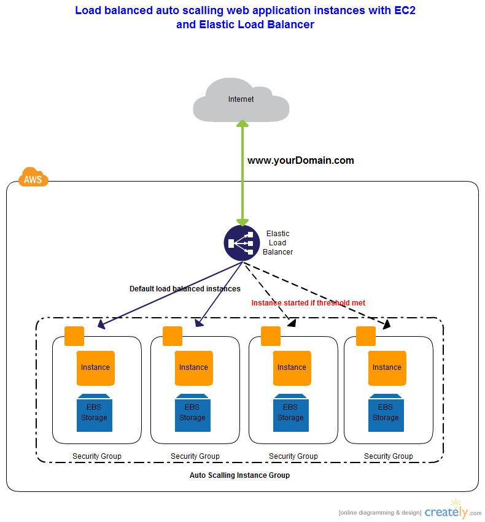

<h1 align="center">DevOps-EC2</h1>

Learning notes for DevOps - EC2

## Root Device
- EBS: Storage persistent on the EBS volume
- Instance storage: server restart or fail will lose stored data

## EFS

- Automatically scalable - that means that your running applications won't have any problems if the workload suddenly becomes higher - the storage will scale itself automatically. If the workload decreases - the storage will scale down, so you won't pay anything for the storage you don't use.
- EFS file system is excellent as a managed network file system that can be shared across different Amazon EC2 instances

## VPC
- Enables you to launch AWS resources into a virtual network that you've defined. 

## Subnet
- A subnet is a range of IP addresses in your VPC. You can launch AWS resources into a specified subnet. Each service can have its own subnet

## Security Group
- A security group acts as a virtual firewall for your instance to control inbound and outbound traffic
- Security groups act at the instance level, not the subnet level, therefore you can have different sg under same subnet

## Auto Scale Group
- Launch config
- New instance will pick up the latest config from tagrole or terraform

## Load Balancer
- Creates a target group
- You can manually remove instance for debugging

## Infrastructure
- Create ASG
- Create ALB with target group name
- Add target group into ASG so it knows the ASG instance state

## Resources
https://www.youtube.com/watch?v=tMC4h-arGPA